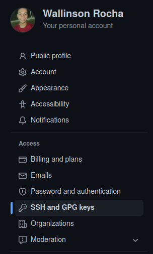
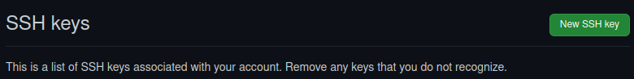

# Aula 1

## O que é git?
O git é um projeto de código aberto criado em 2005 por Linus Totvalds. A sua criação foi necessária para que os códigos de algum sistema, aplicação ou softwares desenvolvidos por mais de uma pessoa fosse mais fácil em sua interação. Com ele seria possível compartilhar e trabalhar em um mesmo arquivo sem a necessidade da pessoa estar presente no local trabalhando na mesma maquina e fazendo longas manutenções no código. Cada um trabalha em sua máquina e compartilha suas alterações para a máquina dos demais na equipe de forma bem mais simples, prática e rápida.

## Como instalar o Git
A instalação do Git pode ser feita [nesse site](https://git-scm.com/downloads). Basta selecionar o seu sistema operacional, seguir e ler a orientações e fazer a instalação. Ela é feita de forma bem simples.

Caso você use linux e prefira instalar pelo terminal, basta digitar:
```
sudo apt-get install git
```

---

# Github? SSH?
Após a instalação, você irá precisar de uma plataorma para fazer a hospedagem dos seus repositórios. No nosso caso iremos usar o GitHub.

Após fazer o seu cadastro na github, iremos criar a chave SSH para ficar salva na sua máquina. Com a chave SSH registrada em sua máquina, não será necessário usar Tokens para subir o seus códigos no github.
> Os tokens são como senhas. Eles são criados na [área de Tokens](https://github.com/settings/tokens) no github. Com ela nós definimos o tipo de permissão que o usuário que a possui terá.

Os exemplos abaixos são semelhantes no Windows.

## Chave SSH no linux
> A partir daqui, você já deve ter o seu git configurado em sua máquina. Ela deve ter o usuário, email... tudo configurado. Para fazer esse processo, você pode ir à aula 3 e, em seguida, assim que terminar o processo de configuração, poderá voltar pra cá.

### 1. Criação
Para isso, devemos abrir o terminal e digitar:
```
ssh-keygen -t ed25519 -C <email
```
Esse "ed25519" é o tipo de criptografia. Vale ressaltar que o email usado deve ser o mesmo que foi cadastrado no Github.

Assim que você der enter, ele irá mostar:
1. Local que será salvo (Dê enter para confirmar);
2. Cadastrar senha (Se não quiser, pode deixar em branco e pressionar Enter);
3. Confirmação da senha (Se não houve senha, pode deixar em branco e da enter).

### 2. Acessando a chave

Assim que esse processo for concluído, ele irá salvar na pasta que foi indicada.
> Obs, ela é uma pasta oculta. Você pode acessá-la com pelo explorador de arquivo do seu linux desde que esteja habilitado a função de ler arquivos ocultos.
Você pode navegar até a pasta.
```
cd home/user/.ssh/
```

Lá dentro haverá a chave pública e a chave privada. Você poderá ver pelo terminal usando o comando "ls".
Você poderá abrir e copiar o conteúdo que está lá ou expor o conteúdo no terminal usando:
```
cat id_ed25519.pub
```
Ela será necessária quando formos registrá-la no GitHub.

### 3. Registrando no GitHub.
Após isso, no nosso github, iremos até Settings. Lá iremos navegar até SSH and GPG keys e gerar uma nova chave.



Após isso basta adicionar um título para a chave e, em seguida, copiar o conteúdo que foi colado do terminal.


### 4. Finalização
Apoś isso, basta rodar no terminal os seguintes códigos:
```
eval $(ssh-agent -s)
```
```
ssh-add id_ed25519
```

Dessa forma estaremos acionando a chave.