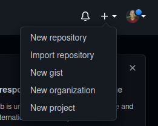
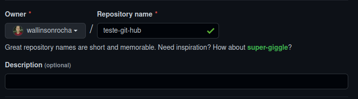
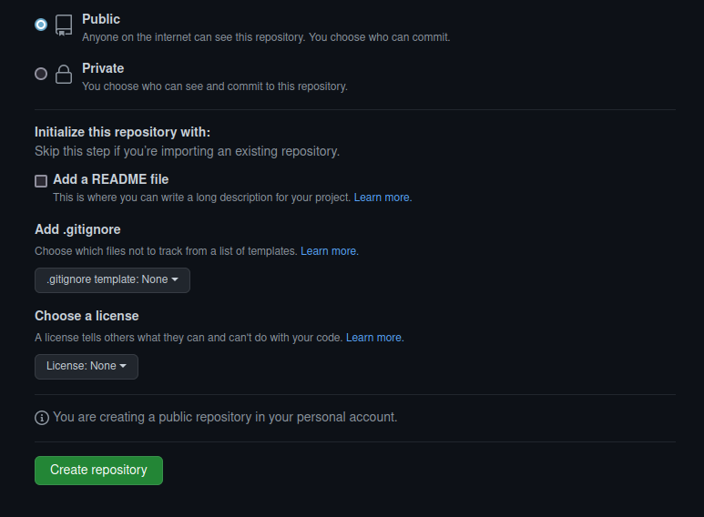
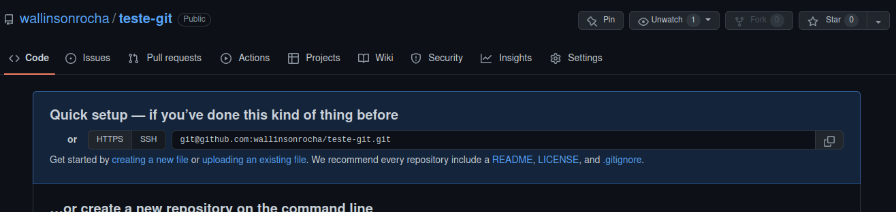

# Aula 2
Essa parte será bem básica. É a patir dos repositórios que você terá acesso aos seus arquivos ou arquivos de outras pessoas.

## Criando repositório.
Você poderá criar o seu repositório no símbolo de + ao lado do seu perfil no canto superior direito:

Basta clicar em "New repository".

Após isso, vamos criar um nome para ele. Você pode adicionar uma descrição se quiser. 
> Ao criar o nome ele não deverá ter espaços ou caracteres especiais. Caso contrário, ele irá salvar em outro format. Logo, seja simples.

Você poderá privatizá-lo, se quiser. Após isso, caso também queira, poderá adicionar um README. Mas, no nosso caso, não iremos fazer isso a fins didáticos para a próxima aula.

Assim que ele for criado, você terá a opção de acessá-lo através do https ou da chave SSh. No nosso caso, nós iremos copiar o SSH.

Nós iremos aprender a adicionar os arquivos na próxima aula.