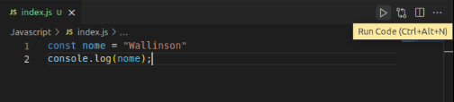

# Aula 1

## O que é Javascript?
O javascript é uma linguagem de programação desenvolvida por Brendan Eich em 1995. Ela foi implementada, inicialmente, no navegador chamado Navigator a fim de fazer requisições ao servidor. Sendo assim, nasce o javascript.

Atualmente, os navegadores utilizam o ECMAscript que é a especificação usada para implementar a linguagem JavaScript.

Hoje em dia o Javascript é utilizado em aplicativos mobile, programas para desketop e, principalmente, a Web.

## Conceitos básicos
Para poder testar o javascript, você pode acessar a opção de "Console" no seu navegado ao apertar a tecla F12 ou Inspecionar com o botão direito do Mouse.


Recomenda-se, principalmente, utilizar algum editor de código como o Sublime ou o Vs Code. Nas anotações, você verá muitos exemplos com o VsCode.

Além disso, implementá-lo no HTML irá melhorar as suas experiências. Caso você ainda não saiba implementá-lo, basta seguir a seguinte orientação:

1. Criar uma pasta com um arquivo chamado  "index.html" e adicionar o seguinte código:
```
<!DOCTYPE html>
    <html lang="pt-br">
        <head>
            <title>Título</title>
        </head>
    <body>
        <script></script>
    </body>
    </html> 
```
2. Na mesma pasta que foi criada, você irá criar um arquivo com a extensão ".js". Por exemplo: main.js.
3. Após isso, você irá anexá-lo na tag script da seguinte forma:
```
<!DOCTYPE html>
<html lang="pt-br">
    <head>
        <title>Título</title>
    </head>
<body>
    <script src="./main.js"></script>
</body>
</html> 
```

Assim que você criá-lo, basta ir no seu navegador, apetar o botão F12 ou ir em inspecionar com o botão direito do Mouse e ir até Console. Lá irá começar a nossa brincadeira.

## Instalação a extensão Code Runner Extension do Vs Code

Essa será a maneira que mais utilizaremos no início.

Para isso, nós iremos baixar e instalar o [VsCode](https://code.visualstudio.com/download). Após isso, iremos ir até extensões (estará do lado esquedo como na foto abaixo) e iremos procurar e instalar o Code Runner Extension.


Sempre que quisermos compilar algum código javascript basta ir no botão de play ou apertar "Ctrl+Alt+N".


## O que são variáveis?
As variáveis, no javascript, é onde nós armazenamos os valores. Há várias maneiras de delcarar variáveis:

### var
São variáveis universais. Ou seja, elas podem ser chamadas fora do escopo.
Imaginem que temos uma caixa e dentro dela caixa há outras caixas menores. Se declaramos uma variável "var" dentro de uma dessa caixinhas, ela pode ser recebida e reconhecida por outras caixinhas. Esse tipo de declação não é mais tão utilizada nos programas atuais. Além disso, elas podem ter os seus valores alterados.
```
var numero = 19;
```
### let
São variáveis específicas. Ou seja, elas não podem ser chamadas fora do escopo.
Citando aquele mesmo exemplo acima, se declararmos uma variável "let" dentro de alguma caixinha, ela será reconhecida somente dentro daquela caixinha. Ou seja, ela não será reconhecida fora dela, apenas por ela e por outras caixinhas que estejam dentro dela. Além disso, assim como o "var", o "let" pode ter o seu valor alterado.
```
let numero = 19;
```
### const
São variáveis que devem receber um valor imediato e não pode se mudado. Ela é declarada, geralmente, fora de todas as caixas pois é uma constante. Ou seja, diferente do "var" e do "let", a variável "const" não pode ter o seu valor modificado.
```
const pi = 3,14;
```

> Obs: Quando uma variável é declarada, ela deve começar com letras minusculas e não pode iniciar com algum caractere especial ou numeração. Caso seja um nome longo, escrevemos no estilo "camelCase". Exemplo "numeroRomano1".

## Tipos de valores:
Ao declarar uma variável, quando armazenamos algum valor, ele pode ser de vários tipos (esses tipos são automáticos. São identificados assim que você implementa algum valor).

### String
As variáveis do tipo string armazenam letras. Nela podemos declarar um conjunto de caracteres.
```
let nome = "Goku";
let frase = "Oi! Eu sou o Guku!"
```
Podem ser declaradas com aspas simples('nome ou frase') ou aspas duplas ("nome ou frase").

Uma outra forma de declará-la é com o sinal de crase. Ela é bastante útil em alguns momentos pois podemos fazer mais brincadeiras com elas. No momento, esse não é o nosso foco, mas lembre-se dessas formas.
```
let nome = `Frase aqui ou um nome`;
```
### Number
As variáveis do tipo number armazenam números inteiros ou fracionados sendo eles positivos ou negativos.
Em linguagens como o Java ou o C, podemos encontrar tipos como int, float, long, double e entre outras.
```
let numero = 19;
let pi = 3,14;
```
### Bolean
As variáveis do tipo booleano recebem valores "false" ou "true". Geralmente são usadas em funções para serem verificadas pelas condicionais. Um exemplo básico é atravessar a rua. Se vem carro, então não vamos. Ou seja, retornamos na nossa mente o valor de "false", mas, caso não venha, atravessamos.
```
let atravessar = false;
```

> Obs.: As variáveis (com excessão do const) podem ser declaradas sem precisar especificar o seu valor no início. Por exemplo "let nome;". Quado é assim, significa que armazenaremos o seu valor futuramente.