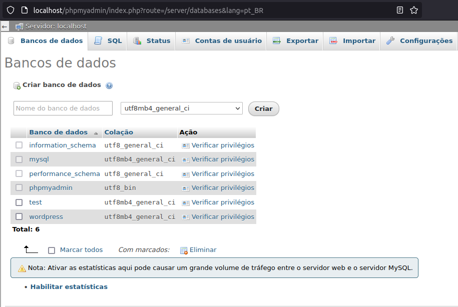
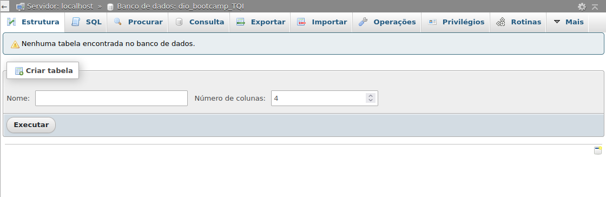
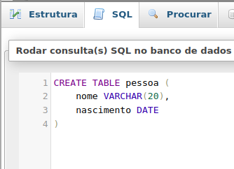
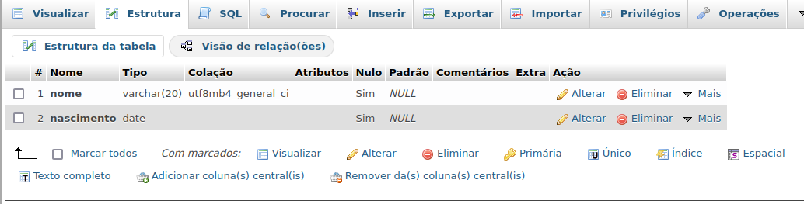

# SQL

Os bancos de dados servem para armazenar aquilo que, em seu site, deve ficar no servidor para acessar quando precisar. Um exemplo disso são os dados de um cliente como as sua senhas, email, preferências e etc.

## Ferramentas
Para poder fazer isso, nós podemos usar algumas ferramentas como o MySQL (que é um banco de dados gratúito) e o phpMyAdmin (sistema que gerência o banco de dados). Não há apenas estas ferramentas, no mercado, mas são os mais utilizados.

Para instalar elas podemos usar o XAMPP. Ele está disponível para windows, linux e macOs. Podem acessar por [aqui](https://www.apachefriends.org/pt_br/index.html).

## Criando o banco de dados
Após a instalação do XAMPP e a sua inicialização, nós iremos digitar "localhost/phpmyadmin" no navegador para acessar os dados que serão criados e administrados. Assim que entramos, iremos criar uma tabela. Para isso vamos até "Banco de dados", adicionar o nome no espaço em branco e criar.

Assim que criamos, entramos em sua estrutura.

Para criar, vamos utilizar os comandos do SQL. Ele funciona como um terminal. Para isso, basta selecionar SQL, que está ao lado de estrutura. Para iniciar, vamos criar a tabela pessoa:

Após isso, podemos executar com "Ctrl+Enter".

Para ver oque há na tabela, basta selecionarmos ela e ir até estrutura. Lá poderemos ver o que tem armazenado.

> É importante sabermos usar os comandos para serem executados pelo backend.

