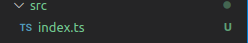

# Aula 1 

## O que é Typescript?
É um "superset" para o javascript com tipagem estática, novos recuros e que compila para Javascipt puro.
Por ser um superset do javascript, ele aceita todas as funções que o javascript tem. Então nós podemos escrver javascript normalmente que será entendido. Mas, se ele já entende javascript, por que eu preciso aprender Typescript?
Através do typescript nós podemos definir que tipo de variável ela será assim que declararmos ela, diferente no Javascript. Pode parecer um detalhe bobo, mas isso pode ajudar muito a diminuir a quantidade de Bugs no programa.

Exemplo: Vamos supor que nós escrevemos uma função que receba, como parâmetro, números para serem multiplicados. Mas, em um dado momento, nós enviamos um parâmetro de outro tipo. O que iria retornar?
```
function multiplyNumbers(x, y){
    return x*y;
}

const result = multiplyNumbers(10, [1,2]);
console.log(result); 
//Nan
```
Como resultado nós receberemos NaN (not a number), pois o tipo não foi reconhecido pelo javascript.

Com o typescript isso poderia ser evitado. 
```
function multiplyNumbers(x: number, y: number){
    return x*y;
}

const result = multiplyNumbers(10, [1,2]);
console.log(result); 
//Nan
```
O resultado ainda seria NaN, mas, na construção do código, diferente do javascript, ele iria indicar que há um erro. Diria que o tipo indicado não é um número.

## Inicialização básica antes da instalação
1. Para iniciar, vamos criar uma pasta para armazenar os projetos em Typescript.
2.  Após isso, nós vamos criar o arquivo ".gitignore". Dentro dele nós iremos por os arquivos que não irão subir no repositório do git. Para isso, recomendo o site "gitignore.io". Lá vocês irão buscar pela chave "Node". Após isso, ele irá nos direcionar a uma pagina que contem os arquivos que não irão para o repositório. Nós podemos copiar e colar. Caso haja algum que você deseja que suba para o github, pode personalizar como você deseja.

3. Após isso vamos dar um "npm init -y" para iniciar.
> Obs.: Você precisa ter o Node instalado em sua máquina.
```
npm init -y
```

---

## Instalação
### 1. Assim que foi dada a inicialização, nós podemos instalar o Typescript a partir do seguinte comando:
```
npm i typescript -D
```
Dessa forma, ele irá instalar as dependências para rodar o typescript.

### 2. Nós iremos instalar uma dependencia no arquivo package.json que foi criado na nossa pasta. Podemos colocar manualmente ou com o seguinte comando (recomendado):
```
npm i ts-node -D
```

No arquivo, a parte de "devDependencies" ficará mais ou menos assim:
```
...
"devDependencies": {
    "ts-node": "^8.10.2",
    "typescript": "^8.10.2"
}
```

Após isso, iremos criar a pasta ".vscode". Nela nós iremos fazer uma consfiguração ambiente do próprio vs code mas quando dentro de um arquivo. Dessa forma não afeta o vs code de forma global.
Após isso, nós iremos criar um arquivo "settings.json" e configurar a extensão Code Runner Extensio dessa forma:


### 3. tsconfig.json
Para Instalá-lo, basta rodar no terminal o seguinte comando:
```  
npx tsc --init
```
Assim será criado um arquivo "tsconfig.json". Nele nós iremos habilitar e configurar as seguinte linhas:
```
...
"lib": ["ESNext", "DOM"], // O que será usado no typescript
...
```
```
...
"outDir": "./dist", // Pasta que será criada com os arquivos js ao compilar o ts com "npm tsc" no terminal
...
```
Através desse ./dist que os nossos arquivos compilados estarão. Para compilar basta por no terminal:
```
npx tsc
```

Após isso, no mesmo arquivo (tsconfig.json), logo após o "compilerOptions" iremos adicionar o "include".
```
"compilerOptions": {...},
"include": [
    "./src"
]
```

### 4. Para finalizar, nós iremos criar uma pasta chamada "src". Lá nós iremos colocar os nossos arquivos "ts" (extensão do typescript).

